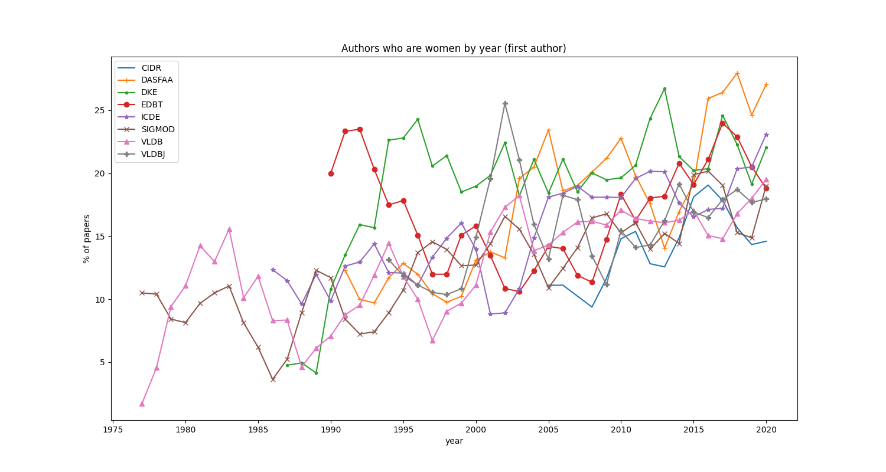
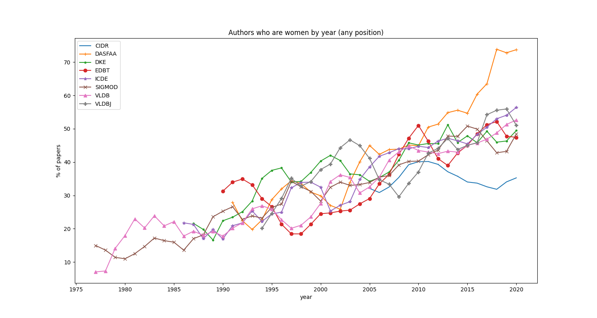
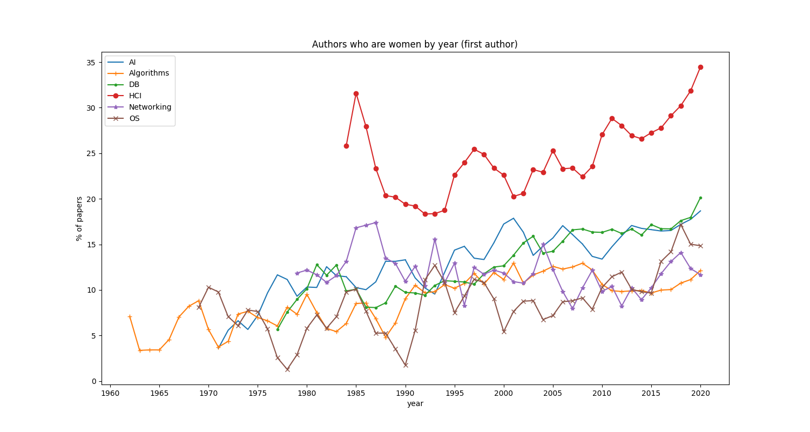

# GAP: Gender Analysis for Publication

This repository and its data are the basis for our 2021 SIGMOD Record
[publication](https://sigmodrecord.org/2021/12/31/how-inclusive-are-we-an-analysis-of-gender-diversity-in-database-venues/)
"How Inclusive are We? An Analysis of Gender Diversity in Database Venues" (Angela Bonifati, Michael J. Mior, Felix 
Naumann, Nele Sina Noack). It can easily be adapted to other publication lists and venues. Feedback is welcome.

## An analysis of gender distribution in scientific publications

We determine the gender of a scientist using the commercial tool 
[Gender-API](https://gender-api.com/) on the basis of first names. Results are `female`, `male`, `neutral` or `unknown`.
For authors with unknown or neutral gender, we randomly assign one of the binary genders based the ratio between unique 
woman and man among the other authors. As this is a random process, it will produce different outcomes with each 
execution resulting in slightly different plots.

While we realize that gender is not a binary concept distinguishing women and men, we do not have the means 
to identify any more fine-grained designations based on the given data (first names), which matches that which reviewers
and readers usually also have at their disposition. 

#### Some of the plots of the SIGMOD Record publication:
3-year moving average of authors at first positions who are woman by year for selected database venues:


3-year moving average of authors at any position who are woman by year for selected database venues:


3-year moving average of authors at first position who are woman by year for selected computer science fields:



## Setup

Clone the repository and install all dependencies. We use pipenv to manage dependencies, so this must be installed 
first. To install other dependencies, run `pipenv install`.
To obtain the publication data of interest, we use [dblp-retriever](https://github.com/nenock/dblp-retriever) which is 
soon going to be installed as a submodule here.

## Usage

### Get help and documentation
Run `pipenv run python3 analyse_dblp_data.py --help` to get the list of possible subcommands `analyse_dblp_data`
provides.
To obtain information about the subcommand, just run `pipenv run python3 analyse_dblp_data.py <subcommand> --help`. 

### Extract unique first names for initial gender-annotation
We use the Gender-API to determine the gender of author's first names (sometimes middle names are used).
As this is a commercial tool, we do not provide the gender-annotated list of first names but the raw list of 
first_names. Run the following if you want to generate the raw list of first names based on different venue data.
All csv files under `input` are used to generate that list. The list is saved under `helper_files/first_names.csv` or 
any destination, you choose as the last option of the command:

```pipenv run python3 analyse_dblp_data.py prepare-names-for-gapi helper_files/first_names.csv```

### Get gender-annotations for first names from [Gender-API](https://gender-api.com/)
Upload the list of first_names (`helper_files/first_names.csv`) to the Gender-API and save the result under 
`helper_files/GenderAPI`. 

### Run the gender analysis
After receiving one or more lists of gender-annotated first names under `helper_files/GenderAPI`, run the following
command with the path to a specific file or to a directory to use all files in there to do the gender analysis.
The present implementation of `analyse_data` is designed specifically to obtain / reproduce the results of the SIGMOD 
Record publication. To run a different analysis, you may need to do some modifications there.

```pipenv run python3 analyse_dblp_data.py analyse-data helper_files/GenderAPI/``` OR

```pipenv run python3 analyse_dblp_data.py analyse-data helper_files/GenderAPI/first_names_gapi_processed.csv```

It saves the gender-annotated list of authorships under `output/with_genders` and produces `.pgf` plots saved to 
`/output`. Statistics (first and last publication year, overall number of papers and overall number of unique authors)
of the venues are saved to `output/statistics.txt`.

If you later add new submission data with potential yet unseen first names, just run the analysis, pass 
`helper_files/unprocessed_first_names.csv` to the Gender-API and add the result to `helper_files/GenderAPI`.

### Get names of unknown or neutral gender for manual annotations
If you want to manually annotate the gender of known persons that were given a neutral or unknown gender by the 
Gender-API, run the following command to get a list of these persons. For a dblp's author id, it adds all in the 
publication data used names of that person as well as links to the papers to give you a starting point. Inspect `--help`
for default source and destination paths or specify them.

```pipenv run python3 analyse_dblp_data.py extract-unknown-neutrals```

OR with specified source and destination files:

```
pipenv run python3 analyse_dblp_data.py extract-unknown-neutrals 
--source output/with_genders/<example-file>.csv 
--destination input/known_identities/<example-file>.csv
```


Just add a `1` in the applicable gender column for persons whose gender you can identify with certainty. 
You can find an annotated sample output file under `input/known_identities/sample_file.csv`. 
